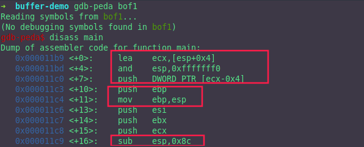
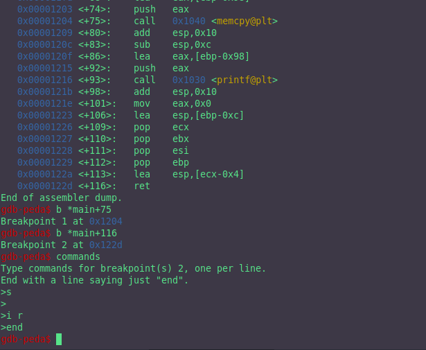

# Introduction
**Winter here so** 
Stack based buffer overflow is the most known exploit for taking over code execution. This as the name suggest, is accomplished by overflowing a buffer into the adjacent memory, just like a glass placed inside a larger glass when it overflows the extra content spills into the larger glass.

## What is a Buffer ?
This is a region of memory used to temporarily store data while it is being moved from one place to another. 

==In our case we can say a buffer is a storage location where arrays alocate space.

Syntax: 
```c
type array[buffer_length];
```

Example:
```c
char input[50];       // An array of up to 50 characters. 
char c = input [49]   // max
char c= input [250]   // accessing memory outside the array
```

## What is the Stack ?
A stack is contiguous block of _LIFO_ memory which is used by functions to store arguments and dynamically allocate space for local variables. The stack grows downwards from higher memory address towards lower memory address.

The stack consists of frames which are pushed when the function is called and poped when the function is finished.
- **pop**: removes a frame off the stack  
- **push**: adds frame ontop of the stack

To accomplish this there are 2 registers used to keep traack of the stack:
- **EBP** : Holds the current address of the stack
- **ESP** :  Stack pointer, points to the top of the stack

##### Layout

Functions can access local variables by offsets of ESP; but since WORDS(4butes ) are pushed and poped
of the stack it is recommended to use something called a frame pointer “FP”.


#### How it Works
When a function is called with arguments, the arguments are pushed backwards on the stack then followed by the instruction pointer  which  is pushed right after, this is commonly known as the return address of the function. at this point the stack pointer points at our return address, in the called funtion, the following steps take place:
```nasm
push ebp                     ; save the old ebp on the stack
mov ebp, esp                 ; save the address of esp(return address) to ebp
sub esp, 0x20                ; make space on the stack for local variables

```
So basically the current frame(ebp) is pushed onto the stack then our previously saved instruction pointer becomes the new frame pointer(ebp).You can say its an indicator to the start of the function. Then space is made by subtracting from the esp, the created space is where our functions local variable will be.


## What is Stack Based Overflow  ?
A buffer overflow occurs when a function copies data into a buffer without doing bound checking. So if the source data size is larger than the destination buffer size this data will overflow the buffer towards higher memory address and probably overwrite previous data on stack, please note that the stack grows downwards from higher memory to lower but arguments are pushed backwards from lower to higher. 

**Example of  vulnerable code**
```c
#include<stdio.h>
int main(int argc, char *argv[]){
	char buff[128];
	memcpy(buf, argv[1], strlen(argv[1]));
	printf(buf)
}
```
We will compile the code without any protection mechanism and will enable them one by one as we continue.

###### flags
```
-m32                                   :  this is so we compile a 32bit binary
-fno-stack-protector                   :  Disable stack protection
-z execstack                           :  make stack executable
-o <filename>                          :  output
```

#### Demo
Now we use GDB to disassemble (ill be using gdb peda for its awesomeness in memory investigation)

 

This shows what weve discussed so far, the function arguments are pushed onto the stack then the old frame pointer(ebp) then esp is moved into ebp making that the new frame pointer then space of 140 is created for the local variable(our buffer).

Now we know the size alocated for our buffer lets try supplying more than that and see what happens.
![] (../assets/Pasted image 20220314153859.png)


Wooo now lets check what the hell happened, we go back to gdb and set a breakpoint at memcpy and the ret instruction. Then we automate using commands: we set it to step when it reaches the second breakpoint and inspect the registers.


Lets run supplying it with giving it more than it can chew


Hiting the first breakpoint all is still wellish, this shows us the stack layout and we can basically predict what will happen next, lets continue and see


OOOH we overwrote our esp in other words we have overwritten the next instruction pointer


Now we have an overflow but how can we exploit this
